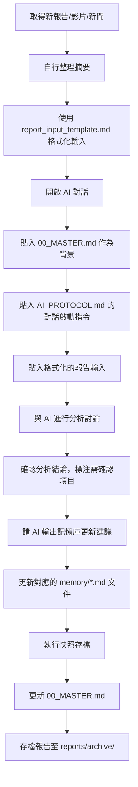

# 🧠 個人投資分析數位共生系統 — 完整使用指南

> **系統定位**：本系統是您與 AI 之間的「外部大腦」，解決三大核心痛點：AI 幻覺問題、對話脈絡長度限制、以及投資判斷的長期累積與追溯。系統以 Markdown 為核心格式，相容 Notion、GitHub 與任何支援 Markdown 的工具。

---

## ▌一、系統全貌

### 設計哲學

本系統的核心理念是「**人負責判斷，AI 負責整理**」。您擅長挑選資料、形成直覺判斷，但需要一個結構化的外部系統來幫助您釐清概念、統整資訊，並讓每次 AI 對話都能在完整脈絡下進行。系統透過以下四個機制實現這個目標：

第一，**外部主控制文件**取代 AI 的對話記憶，讓每次新對話都能瞬間載入您的完整投資背景，不再受限於 AI 的脈絡長度。第二，**動態記憶庫**以結構化方式儲存您的觀點演變，附帶時間戳與信心度，讓判斷脈絡永久可追溯。第三，**快照機制**確保每次分析後的狀態都被完整存檔，形成可回溯的決策歷史。第四，**統一輸入格式**強制資料在進入 AI 分析前先被您消化整理，從根本上降低 AI 幻覺的發生機率。

### 文件體系架構

```
📁 investment-brain/
│
├── 📄 00_MASTER.md                    ← 主控制文件（每次對話的起點）
├── 📄 AI_PROTOCOL.md                  ← AI 對話協議（控制 AI 行為）
├── 📄 snapshot_SOP.md                 ← 快照存檔標準作業流程
│
├── 📁 memory/                         ← 動態記憶庫（核心知識資產）
│   ├── 📄 macro_view.md               ← 總體經濟觀點
│   ├── 📄 industry_view.md            ← 產業觀點
│   ├── 📄 stock_tracker.md            ← 個股追蹤
│   └── 📄 my_thesis.md               ← 個人持倉邏輯與決策日誌
│
├── 📁 snapshots/                      ← 定期快照存檔
│   ├── 📄 2025-01-15_SNAP-001.md
│   ├── 📄 2025-02-03_SNAP-002.md
│   └── 📄 （持續累積）
│
└── 📁 reports/                        ← 報告資源庫
    ├── 📄 report_input_template.md    ← 統一輸入格式模板
    └── 📁 archive/                    ← 歷史報告摘要庫
        ├── 📄 2025-01-15_macro_MS.md
        ├── 📄 2025-02-03_industry_semi_GS.md
        └── 📄 （持續累積）
```

---

## ▌二、各文件說明與使用時機

| 文件 | 用途 | 使用時機 |
|------|------|----------|
| `00_MASTER.md` | 系統入口，儲存當前狀態摘要 | 每次開啟新 AI 對話時貼入；每次快照後更新 |
| `AI_PROTOCOL.md` | 定義 AI 行為規則，防止幻覺 | 每次對話時附加「對話啟動指令」區塊 |
| `memory/macro_view.md` | 總體經濟觀點記憶庫 | 閱讀總經報告後更新 |
| `memory/industry_view.md` | 產業觀點記憶庫 | 閱讀產業報告後更新 |
| `memory/stock_tracker.md` | 個股追蹤記憶庫 | 閱讀個股報告或法說會後更新 |
| `memory/my_thesis.md` | 個人持倉邏輯與決策日誌 | 做出重大決策後記錄；定期自我檢視 |
| `snapshot_template.md` | 快照存檔模板 | 每次分析完成後複製填寫 |
| `snapshot_SOP.md` | 存檔流程 SOP | 執行快照時參考 |
| `report_input_template.md` | 統一報告輸入格式 | 將報告交給 AI 分析前使用 |
| `report_archive_template.md` | 報告摘要存檔模板 | 每份報告分析完成後存檔 |

---

## ▌三、日常工作流程

### 標準分析流程（每次分析）



### 每週例行維護（建議週末執行）

每週花 15-20 分鐘執行以下維護工作：回顧本週的快照，確認所有記憶庫文件都已更新，清理 `00_MASTER.md` 的「待解決問題」清單，並將已解決的問題標記完成。

### 每月深度彙整（建議月底執行）

每月花 1-2 小時進行深度彙整：將當月所有快照貼入 AI，請 AI 彙整當月判斷變化趨勢，更新 `00_MASTER.md` 的宏觀摘要，在 `my_thesis.md` 填入已到期判斷的實際結果，並將系統版本號遞增。

---

## ▌四、平台部署建議

### 方案 A：GitHub（推薦，適合版本控制需求）

GitHub 是本系統的最佳主平台，原因在於：Git 的版本控制天然實現了快照的不可篡改性，每次 `commit` 都是一個帶有時間戳的歷史紀錄；Markdown 文件在 GitHub 上自動渲染，可直接閱讀；免費且永久保存。

**建立步驟**：
1. 在 GitHub 建立私有倉庫（Private Repository），命名為 `investment-brain`
2. 將所有文件上傳至倉庫
3. 每次執行快照後，使用 `git commit -m "SNAP-XXX: 更新摘要"` 提交

### 方案 B：Notion（推薦，適合視覺化需求）

Notion 適合作為「閱讀與查詢介面」，搭配 GitHub 使用效果最佳。

**建議架構**：
- 在 Notion 建立「投資大腦」工作區
- 將 `00_MASTER.md` 設為首頁，每次更新後手動同步
- 使用 Notion Database 建立「快照索引」，每次快照後新增一筆記錄
- 使用 Notion Database 建立「報告資料庫」，對應 `reports/archive/`

### 方案 C：混合部署（最佳效益方案）

| 平台 | 負責功能 | 理由 |
|------|----------|------|
| **GitHub** | 版本控制、快照存檔、原始文件主庫 | 不可篡改的歷史紀錄，版本追蹤 |
| **Notion** | 日常閱讀介面、快照索引、報告資料庫 | 視覺化友好，搜尋方便 |
| **本地編輯器**（VS Code / Obsidian） | 文件編輯、本地草稿 | 離線編輯，支援 Markdown 預覽 |

**同步流程**：本地編輯 → Git Push 至 GitHub（主庫）→ 手動同步關鍵文件至 Notion（閱讀介面）

---

## ▌五、防幻覺機制說明

本系統透過四個層次防範 AI 幻覺問題：

**層次一：輸入端控制**。使用 `report_input_template.md` 強制您在輸入前先整理資料，AI 只能分析您提供的內容，無法自行補充。

**層次二：行為端控制**。`AI_PROTOCOL.md` 的對話啟動指令明確禁止 AI 使用無來源的模糊陳述，並要求標注 `[推論]` 與 `[需確認]`。

**層次三：輸出端驗證**。快照模板中的「AI 對話紀錄摘要」區塊要求您標注每個 AI 回應的驗證狀態，未驗證的資訊不得進入記憶庫。

**層次四：歷史端追溯**。所有進入記憶庫的判斷都附有來源報告與日期，若未來發現某個判斷有誤，可以追溯到原始報告進行驗證。

---

## ▌六、快速啟動清單

完成以下步驟即可開始使用系統：

- [ ] 建立 `investment-brain/` 資料夾結構
- [ ] 將所有模板文件放入對應位置
- [ ] 填寫 `00_MASTER.md` 的初始狀態（您當前的宏觀判斷與追蹤個股）
- [ ] 填寫 `memory/my_thesis.md` 的「個人投資框架」區塊
- [ ] 在 GitHub 建立私有倉庫並推送初始版本
- [ ] 在 Notion 建立工作區並設置首頁
- [ ] 執行第一次快照（SNAP-001），記錄系統初始化

---

## ▌七、文件交付清單

本系統包含以下 10 個文件，請依架構放置至對應位置：

| 文件名稱 | 放置位置 |
|----------|----------|
| `00_MASTER.md` | `investment-brain/` |
| `AI_PROTOCOL.md` | `investment-brain/` |
| `snapshot_SOP.md` | `investment-brain/` |
| `memory_macro_view.md` → 重命名為 `macro_view.md` | `investment-brain/memory/` |
| `memory_industry_view.md` → 重命名為 `industry_view.md` | `investment-brain/memory/` |
| `memory_stock_tracker.md` → 重命名為 `stock_tracker.md` | `investment-brain/memory/` |
| `memory_my_thesis.md` → 重命名為 `my_thesis.md` | `investment-brain/memory/` |
| `snapshot_template.md` | `investment-brain/` |
| `report_input_template.md` | `investment-brain/reports/` |
| `report_archive_template.md` | `investment-brain/reports/` |
